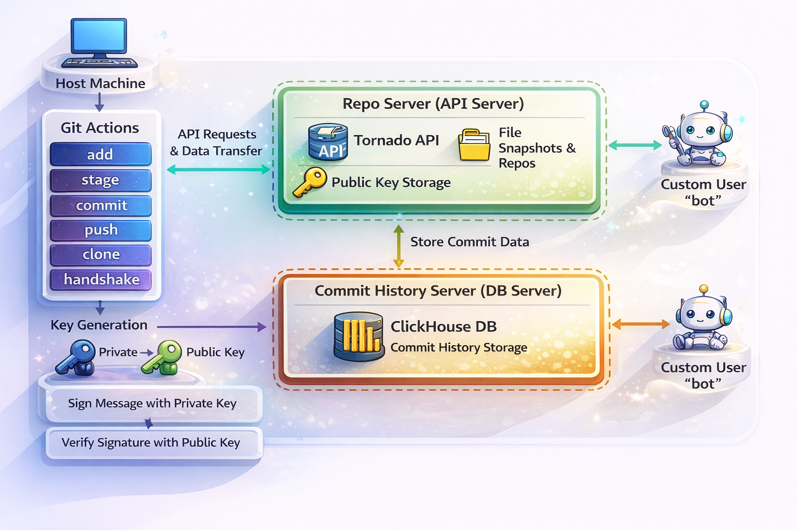

# GitForgeX-Custom-Version-Control-System
A Git-inspired version control system focusing on secure client–server interaction and modular service-based architecture.

**Question & Answers**

Q: What did you build and why?
I built a Git-inspired custom version control system to learn distributed architecture and microservices.
Through this project, I learned how independent services communicate, execute tasks separately, and how load is distributed across multiple services.

Q: Where is your API hosted or stored?
The API is hosted inside the GitForgeX container.

Q: Which framework did you use and why?
I used the Tornado framework because it supports asynchronous request handling, can manage multiple concurrent connections efficiently, and provides a built-in server with simple routing.

Q: Where do you store the public key used for signature validation?
Currently, the public key is stored inside the API server container where snapshots are managed.
In the future, I plan to move it to a separate container to handle key management independently.

Q: Why do you perform a handshake on every push?
A handshake is performed on every push to establish trust and ensure secure communication between the client and server.

Q: Is this system useful for organizations?
At present, it is designed for individual use only.
This is because the system relies on limited host machine resources and is not yet optimized for large-scale organizational usage.

Q: What applications are required on the host machine?
Docker Desktop (Docker Engine for building images and running containers)
Docker Compose
VS Code (for on-demand code modifications)

Q: What basic knowledge is required to understand this project?
Distributed architecture and microservices
Docker and containerization

Basic networking (subnets, IP allocation)
Database management systems

Application frameworks like Tornado
Basic Git commands (add, stage, commit, push, clone, cherry-pick)

